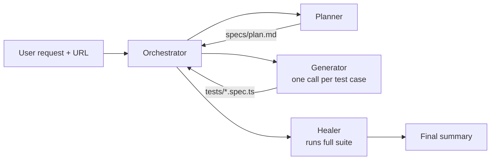

# Playwright Test Orchestrator

**Playwright Test Orchestrator** is a VS Code Copilot agent that automates end-to-end Playwright test generation and execution. It wraps the three built-in [Playwright Test Agents](https://playwright.dev/docs/test-agents) — **Planner**, **Generator**, **Healer** — into a single guided workflow and adds a **`repo-scenario-discovery`** skill that scans the repo for sample questions and scenarios/use cases before planning. The subagents can be used independently, sequentially, or chained through this orchestrator.

## Contents

- [Playwright Test Orchestrator](#playwright-test-orchestrator)
  - [Contents](#contents)
  - [Prerequisites](#prerequisites)
  - [Setup instructions](#setup-instructions)
  - [How a conversion run works](#how-a-conversion-run-works)
  - [Recommended model](#recommended-model)
  - [Folder structure guidance](#folder-structure-guidance)
  - [Known limitations and issues](#known-limitations-and-issues)
  - [Demo instructions](#demo-instructions)

## Prerequisites

Before running this agent, execute the two commands below **in the target repository** to set up Playwright and the Playwright VS Code agents:

```bash
npm init playwright@latest
npx playwright init-agents --loop=vscode
```

You also need:

- Node.js 20+
- **VS Code 1.105 or later** (required by the Playwright agentic experience — see the [Playwright docs](https://playwright.dev/docs/test-agents#getting-started))
- GitHub Copilot Chat enabled in VS Code
- A running web app for that repo (local or deployed) with a reachable URL

> Re-run `npx playwright init-agents --loop=vscode` whenever Playwright is updated so agent definitions and MCP tools stay in sync.

## Setup instructions

1. Open the **target repo** (the app you want tests for) in VS Code.
2. Run the two Prerequisites commands above **inside the target repo**.
3. Start the **`playwright-test` MCP server**: open `.vscode/mcp.json` (created by the init-agents command) and click **Start** above the `playwright-test` entry. The subagents rely on it for browser automation.
4. Confirm a seed test exists at `tests/seed.spec.ts` (see [Seed test](#seed-test) below). The planner uses it to bootstrap the browser context, fixtures, and global setup.

## How a conversion run works

The orchestrator does not automate the browser itself. It sequences the three built-in Playwright Test Agents and uses a repo-discovery skill for context:

1. [Planner](./playwright-test-planner.agent.md) — explores the app (bootstrapped by `tests/seed.spec.ts`) and writes a Markdown test plan under `specs/`. Invokes the [`repo-scenario-discovery`](../skills/repo-scenario-discovery/SKILL.md) skill first to pull sample questions and scenarios from the repo.
2. [Generator](./playwright-test-generator.agent.md) — turns each planned test case into one `.spec.ts` file under `tests/`, verifying selectors and assertions live as it generates.
3. [Healer](./playwright-test-healer.agent.md) — runs the suite, replays failing steps, and patches locators/waits/data until each test passes or is safely skipped.



## Recommended model

**Claude Opus 4.7** (configured in [playwright-test-orchestrator.agent.md](./playwright-test-orchestrator.agent.md)).

Opus handles the multi-stage delegation, long context, and code repair steps reliably. Smaller models can work but may skip stages or produce brittle selectors.

## Folder structure guidance

Inside the **target repo**, expect this layout (follows the [Playwright Artifacts and Conventions](https://playwright.dev/docs/test-agents#artifacts-and-conventions)):

```
<target-repo>/
  .github/agents/
    playwright-test-orchestrator.agent.md   ← main entry point
    playwright-test-planner.agent.md
    playwright-test-generator.agent.md
    playwright-test-healer.agent.md
    README.md

  specs/                                    ← human-readable test plans
    plan.md                                 ← generated by the Planner

  tests/                                    ← generated Playwright tests
    seed.spec.ts                            ← seed test used by the Planner
    <suite-slug>/
      <test-slug>.spec.ts                   ← generated by the Generator

  playwright.config.ts                      ← defines baseURL (see below)
  test-results/                             ← Playwright run output
```

The orchestrator sets `baseURL` in `playwright.config.ts` so generated tests use **relative URLs** (`page.goto('/')` instead of the full deployment URL) and stay portable across environments:

```ts
use: {
  baseURL: process.env.PLAYWRIGHT_BASE_URL ?? 'http://localhost:3000',
  trace: 'on-first-retry',
},
```

## Known limitations and issues

- **Authentication support** — currently, the orchestrator works only with unauthenticated URLs. Support for authenticated URLs (via seed-test-based sign-in) is planned for a future update.
- **Sequential execution within a run** — when the orchestrator runs, plan / generate / heal stages execute one after another (never in parallel) because they share a browser session. The subagents themselves can still be invoked independently outside the orchestrator.
- **One generator call per test case** — large plans take time.
- **Healer fallback** — tests the healer cannot reliably fix are marked with `test.fixme()` (aligned with Playwright's guardrail-stop behavior) rather than deleted.
- **Agent init required** — skipping `npx playwright init-agents --loop=vscode` breaks the pipeline because the Playwright MCP tools won't be registered in VS Code.
- **VS Code 1.105+** — earlier VS Code versions do not fully support the Playwright agentic experience.

## Demo instructions

1. Open the target repo in VS Code and start its app locally (or use a deployed URL).
2. Run the two Prerequisites commands inside that repo.
3. In VS Code Copilot Chat, open the **agent menu** and select **`playwright-test-orchestrator`**.
4. Enter the following prompt:

   ```
   Go to https://app-mv403b4qbg.azurewebsites.net ignore.
   and Create test plan and generate test case to check whether character count reflecting as per typed message in text box.
   Just focus on above single test case only.
   ignore scenario skill as of now
   ```
5. If the app has multiple scenarios, tell the agent which one is currently loaded when it asks.

6. Watch the three stages run in order. When finished, the orchestrator prints a summary with:
   - the plan path,
   - counts of planned / generated / skipped tests,
   - healer results (passing / fixme / failing).